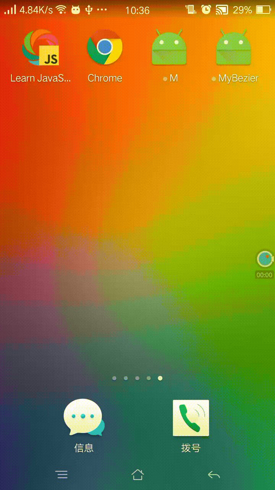

# AnimShape  [](https://www.npmjs.com/package/art-anim-bezier-shape)
It's also named `AnimBezierShape` before version 1.1.0,so please use the newest version.

## What is `AnimShape`?
[中文介绍][6]
When using an `ART.Shape`, we often want a beauty animation on it, but `Animated` is so limited.
`AnimShape` provid a animation in Shape,where you can render smooth curve tardily.

Here is a video([Tencent][3], [Youtube][2]) to show it.

<div>
<a style="display:inline-block"></a>
</div>

[Development Document][5]

## How to get it?
*  `npm install art-anim-shape`;

[Development Document][5];
## Version List
 version | date | contributor | Tag
:-:|:-:|:-:|:-:|
0.1.23|2017/08/25|wangjian|
1.0.0|2017/08/27|wangjian|
1.1.0|2017/08/27|wangjian|
1.1.1|2017/08/27|wangjian|
1.1.2|2017/08/27|wangjian|
1.2.0|2017/08/27|wangjian|

## Attach
If you had install `AnimBezierShape` before, please update it, by following steps:

```jsx
$ npm uninstall art-anim-bezier-shape
$ npm install art-anim-shape
```
E-mail:2946465099@qq.com

[1]:https://github.com/jiarWang/AnimBezierShape/blob/master/AnimBezierShape/src/component/AnimBezierShape.js
[2]:https://youtu.be/WCw3C_P1-yE
[3]:https://v.qq.com/x/page/v054279dial.html
[4]:https://github.com/jiarWang/AnimBezierShape/blob/master/AnimBezierShape/android/app/app-release.apk
[5]:https://github.com/jiarWang/AnimBezierShape/blob/master/Doc/1.2.0.md
[6]:https://jiarwang.github.io/